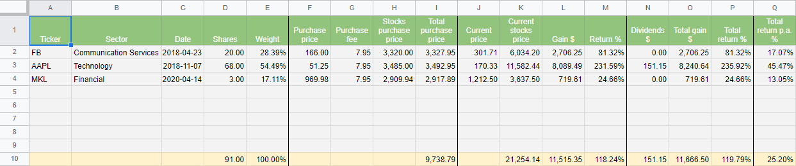
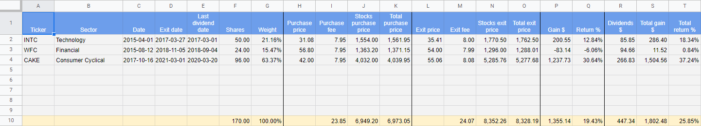
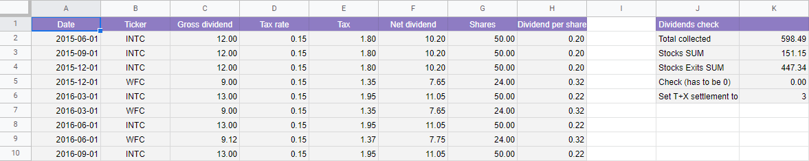
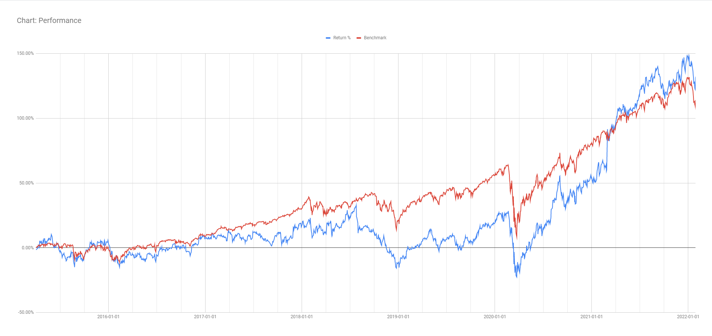
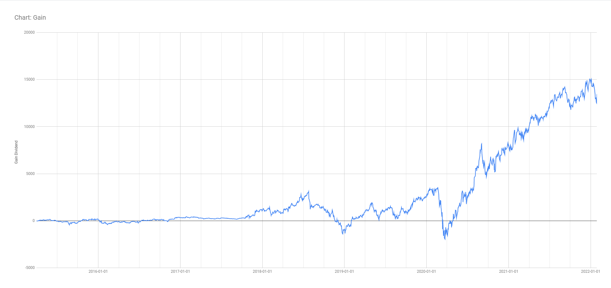
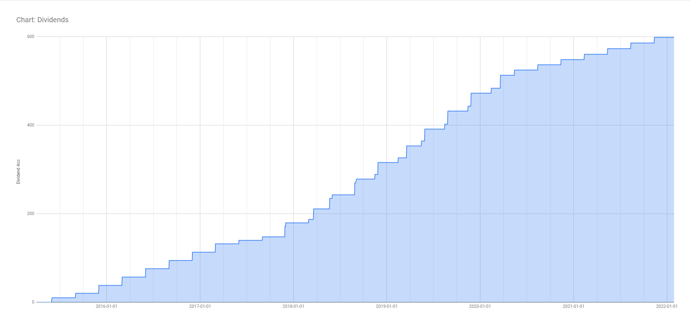
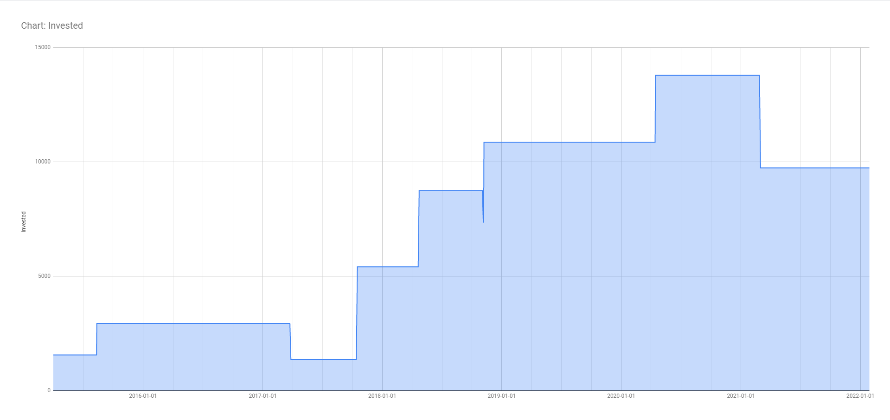

Invest Portfolio Template
=========================

Invest Portfolio Template consists of 2 parts:

- [Google Spreadsheet: Invest Portfolio Template](https://docs.google.com/spreadsheets/d/1VTEo6OMvPDbGmR5H3MjlRd4F6FwINPEHaJ1ub4QdpW8/edit?usp=sharing)
- [Google Apps Script: performance.gs.js](performance.gs.js)

Features
--------

- Stocks portfolio tracker based on Google Sheets
- It uses Google Finance API to get stocks data
- It automatically tracks gains and returns of the current portfolio
- Opened and closed positions are separated
- Each purchase is tracked as a separate holding
- Dividends are tracked manually
- Splits are handled manually
- Script generates stocks portfolio performance in time
- Portfolio performance is compared to a benchmark

Known issues
------------

- Portfolio currently supports only USD
- Return is not calculated as a [time-weighted return](https://www.fool.com/about/how-to-calculate-investment-returns/)

Sheets
------

- Stocks: the portfolio of opened positions
- Stocks Exits: the portfolio of closed positions
- Stocks Dividends: list of received dividends
- Stocks Performance: generated portfolio performance in time

performance.gs.js
-----------------

- This script generates the Stocks Performance sheet
- The sheet has to be re-generated to get new data and to reflect newly added holdings
- Script can be executed from the `Invest Portfolio` -> `Generate performance sheet` menu
- Script can be edited from `Add-ons` -> `Apps Script` menu
- A start date and a benchmark ticker can be set in the performance.gs.js
- If the start date is shifted (e.g., generating a performance sheet for the last year), gains don't start from 0 which is a problem for the benchmark. It can be manually tweaked using the A1 cell.
- It takes some time to calculate the performance. Once it's ready, the sheet is styled in colors.

How to handle stock splits
--------------------------

1. Update "Shares" column in Stocks table
2. Update "Purchase price" column in Stocks table
3. Update "Shares" column in Dividends table
4. Update also Stocks Exits table, but only if there is a time overlap of multiple holdings in Stocks and Stocks Exits

Developed by
------------

[Petr Nohejl](http://petrnohejl.cz)

License
-------

    Copyright 2022 Petr Nohejl

    Licensed under the Apache License, Version 2.0 (the "License");
    you may not use this file except in compliance with the License.
    You may obtain a copy of the License at

        http://www.apache.org/licenses/LICENSE-2.0

    Unless required by applicable law or agreed to in writing, software
    distributed under the License is distributed on an "AS IS" BASIS,
    WITHOUT WARRANTIES OR CONDITIONS OF ANY KIND, either express or implied.
    See the License for the specific language governing permissions and
    limitations under the License.
